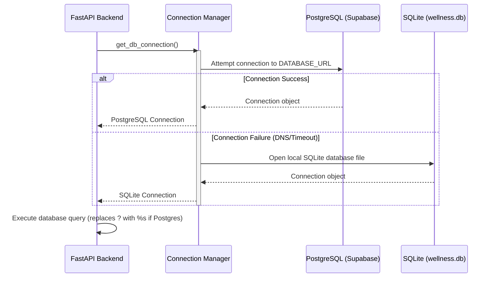

# 📐 CalmMind Architecture Diagram

This document details the system architecture and data flows for the **CalmMind Mental Wellness Tracker** micro-application.

---

## 🏗️ System Architecture Overview

CalmMind is designed as a unified full-stack application following a microservices approach:
1.  **Client Tier:** A single-page application (SPA) built using Vite, React, and Vanilla CSS. It provides a glassmorphic dashboard for logging daily check-ins and reading insights.
2.  **API Tier:** A lightweight FastAPI server that hosts endpoints for health checks, data persistence, and AI wellness analysis.
3.  **Database Tier:** A dual-engine persistence layer that defaults to **PostgreSQL (Supabase)** and gracefully redirects queries to a local **SQLite database** if connection errors occur.
4.  **AI Engine:** Integrates the new `google-genai` SDK to query **Gemini 2.5 Flash** for therapy-centric daily wellness analysis, with rule-based fallback responses.

```mermaid
graph TD
    %% User Interactions
    User[User / Web Browser] -->|Interacts with UI| ReactApp[React Frontend - Vite]
    
    %% Frontend and Backend Interactions
    ReactApp -->|HTTP Requests| FastAPI[FastAPI Backend Server]
    
    %% Backend Modules
    subgraph FastAPI Backend App
        direction TB
        Endpoints[API Router /api/logs] --> ConnectionMgr[Database Connection Manager]
        Endpoints --> AIEngine[AI Insight Generator]
    end
    
    %% Database Integration
    ConnectionMgr -->|Tries Primary Connection| Postgres[PostgreSQL - Supabase]
    ConnectionMgr -->|SQLite Fallback| SQLite[Local SQLite - wellness.db]
    
    %% AI Integration
    AIEngine -->|Queries API Key / X-Gemini-API-Key| GeminiAPI[Google Gemini 2.5 Flash API]
    AIEngine -->|Fallback if Key Fails/Missing| MockGenerator[Mock Insight Generator]

    %% GCP Deployment Architecture
    subgraph Google Cloud Platform (Production Deployment)
        direction LR
        CloudRun[Google Cloud Run Container]
        SecretManager[GCP Secret Manager] -->|Mounts Secrets| CloudRun
        CloudRun -.->|Runs| FastAPI
    end
```

---

## 🔄 Core Workflows

### 1. Wellness Check-In & AI Insight Flow
1.  **Submit Check-In:** The user inputs daily mood rating, sleep hours, stress level, and journal notes.
2.  **Route Request:** The React app posts the check-in data to `/api/logs`.
3.  **AI Generation:** The FastAPI backend extracts the `GEMINI_API_KEY` (either from the request headers or Secret Manager) and queries Gemini 2.5 Flash.
4.  **Resilient Failover:** If the API key fails, CalmMind automatically uses its internal mock generator to produce stable, compassionate advice based on the user's score.
5.  **Database Write:** The log (complete with generated wellness insights) is persisted to the database.
6.  **Update UI:** The dashboard refreshes state, adds the log to history, and expands the new entry with markdown-rendered insights.

### 2. Database Resilience Flow

